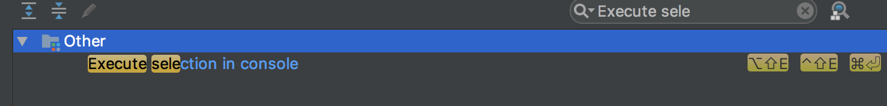
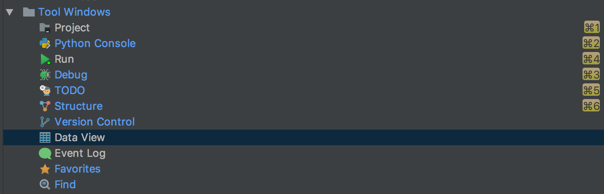
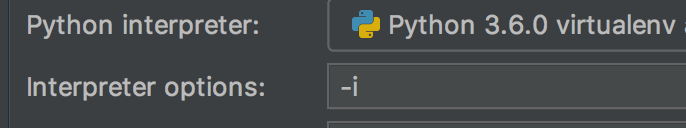
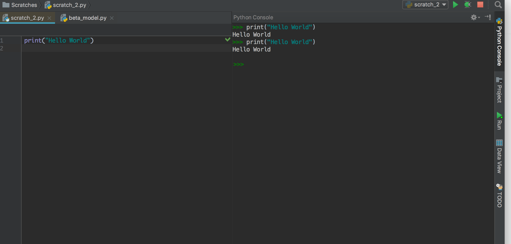

# PyCharm Setup for Rstudio Users

If you are like me, a heavy R user who also programs in Python, might find it's a bit overwhelming to use one of the most popular python IDEs - PyCharm. Here I share some of my personal configurations and keyboard shortcuts to make the IDE more lightweight, manageable, and efficient for data science related tasks. 

### Removing redundant functionalities.

1.  I removed some of the unnecessary plugins, this helps load my IDE faster. This is under `Preferences -> Plugins`. If you primarily use git in terminal or other desktop app like sourcetree, you can pretty much uncheck all the version control plugins. I also unchecked the Terminal module because I'd like to have my terminal in a separate window. 
2.  I simplified my tools windows to be more focused on interactive programming, scripting, and debugging. As a personal preference, I moved all my tools window to the right side , you can do this by clicking on the little gear icon in tools tab and choose `move to -> right`. I only keep 'Project', 'Python Console', 'Run', 'Debug', 'Data View', and 'TODO'
3.  For 'Python Console', I also hide the tool bar since I barely use those tool buttons. 

### Modifying keyboard shortcuts.

Tip: You can search for shortcuts you want to remap by directly  typing in the preference tab search bar. 

1.  As an Rstudio user, I like sending my code directly into the console to run. By default the shortcut in PyCharm is `opt + shift + E` or `ctrl + shift + E`. I switched to `cmd + enter` .  This helps data exploration a lot! Alternatively, you can also install IPython and set it up as your default console.

    

2. I also want to be able to switch my tools windows quickly. So I remapped `cmd + 1`, `cmd+2` , ect., see the image below: 

   

3. Added a key to 'search everywhere', I personally set it to `opt + F`. This helps me to quickly find files and code. 

4. I also added a shortcut key to clear my console ("clear all" in the settings page) with `ctrl + L`. However, you need to click on the content in the console in order to clear the screen. 

### Configuring run options.

Under `Run -> Edit Configurations`, I keep my interpreter options with `-i` :

This lets you have access to all your variables in the 'run'  window after running a script. You can use the run window as an interactive shell, but it's a bit cumbersome to use. 

### Final View

 Here is how my PyCharm looks after all these configurations, simpilified and distraction free:

